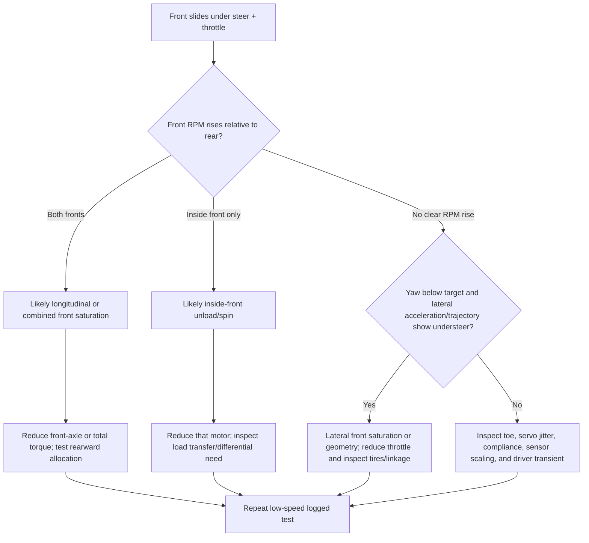

# ESP32 RC Car Engineering Review - 2026-08-10

## 1. Executive result

This review found several software paths that could violate the intended
safety architecture even though the normal drive path was generally cautious.
The most important defects were initialization order, unsynchronized CLI and
control-loop state transitions, ESC calibration without a saved CH4 shutdown
calibration, a direction change possible above minimum throttle in a neutral
transition, unchecked non-finite control gains, and unchecked required task
creation. These conditions were corrected and the changed firmware builds
with ESP-IDF 6.0.1 for `esp32`.

The software result is not a release-to-drive result. The exact ESC SKU and
battery rating are still unconfirmed, the HW86060041 electrical output remains
undocumented, the proposed RPM dividers have not been fully characterized, the
new receiver/servo path has not been validated on the actual car, and torque
vectoring has not been tuned or driven. On 2026-08-12, the user directly
counted seven rising edges per mechanical revolution, confirming the compiled
PPR for the tested motor/sensor. Keep torque vectoring disabled and traction
power isolated until the remaining ordered bench work in section 12 is
complete.

Evidence labels used below:

- **Code:** source, configuration, math, static inspection, build, or logic
  test.
- **Manual/web:** manufacturer documentation, component data sheets, or cited
  technical literature.
- **Inference:** engineering conclusion that still depends on vehicle data.
- **Bench:** physical measurement. No new bench evidence was produced.
- **Drive:** on-car observation. No new drive evidence was produced.

## 2. System and safety flow

The post-review startup and command ownership are:

```text
boot
  -> configure 8 ESC LEDC channels at 1100/1100 us
  -> create controller mutex
  -> load/validate NVS
  -> initialize centered steering, receiver, RPM and IMU
  -> sample stationary IMU yaw bias for 5 seconds
  -> restore safe ESC output
  -> create required powertrain task on CPU1
  -> optionally create sensor task
  -> start CLI only after the required drive task exists

CPU0 GPIO edge ISRs -> validated receiver snapshots
sensor task         -> locked RPM/IMU snapshots
CLI + drive task    -> one serialized controller/output state
drive task          -> ramp/interlock -> optional TV -> bounded LEDC writes
```

Safe ESC output remains four `1100 us` throttle signals and four `1100 us`
reverse signals. CH4 remains a software command; it cannot stop a failed
ESP32, shorted output, or other common-mode hardware failure. An independent,
immediately accessible traction-power disconnect remains mandatory.

## 3. Prioritized code-review findings

Line locations refer to the corrected tree and show the resolution point when
the original code no longer exists.

| ID | Severity | Evidence and trigger | Consequence | Resolution/status |
|---|---|---|---|---|
| F-01 | Critical | Before this review, NVS and configuration initialization occurred before ESC LEDC initialization. See the corrected first call in `main/powertrain_controller.c:1768-1776`. | Boot-time work could occur before valid safe PWM existed, contrary to the explicit startup invariant. | **Fixed (Code):** ESC channels are initialized at safe endpoints first. Initialization failure leaves the application in a non-driving error loop. |
| F-02 | Critical | CLI callbacks and the CPU1 drive loop mutated controller state and outputs without one ownership lock. The corrected recursive mutex begins at `main/powertrain_controller.c:90-110` and covers state/output transitions. | A stale armed iteration could overwrite a concurrent CLI disarm or calibration transition. | **Fixed (Code):** controller operations are serialized; peripheral snapshots retain their narrower locks. |
| F-03 | Critical | ESC endpoint/manual calibration treated missing CH4 calibration as safe. Corrected gates are at `main/powertrain_controller.c:766-787`, `1024`, and `1090`. | A user could enter an energized calibration workflow without a learned receiver STOP position. | **Fixed (Code):** saved CH4 calibration and a recognized STOP position are mandatory. Any missing, RUN, or unrecognized CH4 state cancels the workflow. |
| F-04 | High | A neutral command could force the active direction to forward while throttle was still ramping down. The corrected neutral and direction paths are at `main/powertrain_controller.c:604-650`. | If reverse authority were increased, yellow direction could change above minimum white-wire throttle. | **Fixed (Code):** neutral retains the active direction; a new opposite command must reach minimum and satisfy the 120 ms hold before yellow changes. |
| F-05 | High | CLI `%f` parsing accepts `NaN`/`Inf`, and ordinary range comparisons do not reject NaN. The corrected validation is at `main/powertrain_controller.c:1344-1360`, with controller-side validation at `main/torque_vectoring.c:28-64`. | Non-finite gains could propagate into control arithmetic and integer pulse conversion. | **Fixed and logic-tested (Code):** all gains and live inputs must be finite and in range; failure resets TV and produces equal outputs. |
| F-06 | High | Required task creation was unchecked. Corrected checks are at `main/powertrain_controller.c:1822-1844` and `main/app_main.c:18-36`. | Without the drive task, calibration output could be commanded by CLI without the normal timeout/safety loop. | **Fixed (Code):** CLI does not start if the required powertrain task cannot start. Sensor-task failure keeps TV unavailable. |
| F-07 | High | CH5 previously selected the nearest calibration point even when a malformed pulse was far from every point. Corrected `+/-125 us` recognition is at `main/powertrain_controller.c:415-434`. | An out-of-range CH5 signal could select an active assist mode. | **Fixed (Code):** an unrecognized CH5 pulse selects OFF. |
| F-08 | High | Manual relay passed accepted receiver pulses directly to an ESC API. Final output clamping is at `main/esc_output.c:119-145`. | Accepted receiver range `800-2200 us` is wider than the ESC's `1100-1940 us` range. | **Fixed (Code):** every throttle and reverse write is endpoint-clamped. Manual mode is also documented as clamped. |
| F-09 | Medium | Fixed 100 ms RPM windows produced a one-edge step of `60/(0.1*7) = 85.7 RPM`, matching the reported approximately 86 RPM floor. Adaptive window logic is at `main/rpm_sensor.c:11-13` and `169-191`. | Coarse low-speed feedback and false confidence in displayed precision. | **Improved (Code):** 100-500 ms adaptive windows seek four edges; raw count/frequency/window telemetry was added. Resolution becomes as fine as 17.1 RPM at the now-confirmed 7 PPR, with added low-speed latency. |
| F-10 | Medium | Motor pole count was being used as a proxy for a manufacturer-undocumented sensor pulse ratio. New storage and conversion fields are at `main/config_store.c:225-283` and `main/rpm_sensor.c:138-191`. | A constant-factor RPM error would corrupt speed feedback and could be hidden by gain tuning. | **Ratio confirmed, full validation open:** on 2026-08-12 the user directly counted seven rising edges per mechanical revolution on the tested hardware. Explicit `config rpm ppr 7` is authoritative; all four channels still need waveform and optical-tachometer validation across speed. |
| F-11 | Medium | The integrator was magnitude-clamped but continued accumulating into an already saturated actuator. Corrected conditional integration is at `main/torque_vectoring.c:126-160`. | Windup and delayed recovery after high yaw error or authority saturation. | **Fixed and logic-tested (Code):** integration is held when it would drive farther into the active limit and allowed when it unwinds. |
| F-12 | Medium | IMU transactions and calibration shared mutable bias/sign state with a 5 ms polling task. Corrected mutex and snapshot locks are in `main/imu_sensor.c:25-55` and `123-162`. | Concurrent I2C operations or torn configuration/calibration observations. | **Fixed (Code):** I2C access is serialized with bounded 5/10 ms waits and bias/sign snapshots are protected. Hardware deadline behavior remains pending. |
| F-13 | Medium | Required ESP-IDF peripheral initialization and task results were incompletely propagated. | Partial startup could appear operational. | **Improved (Code):** startup propagates required ESC, steering, receiver, mutex, and powertrain-task failures. RPM/IMU/sensor-task failures are explicitly non-fatal and disable TV. |
| F-14 | Medium | There was no direct WCET, stack, or heap evidence. Instrumentation is at `main/powertrain_controller.c:1430-1468` and `1684-1764`. | Generic ESP32 capacity claims could conceal deadline or stack risk. | **Instrumented, not measured on hardware:** `status` reports execution maxima, overruns, task stack minima, and heap metrics. |
| F-15 | Medium | Steering output used integer-microsecond receiver commands directly, exposing receiver jitter; no persistent trim existed. New behavior is at `main/powertrain_controller.c:112-153`, `270-320`, and `1245-1280`. | Visible jitter and no repeatable electronic centering adjustment. | **Implemented, bench pending:** persistent `+/-15 degree` command-space trim and a 0-500 ms first-order smoothing time constant, default 60 ms. Trim is rejected/reset if it cannot remain strictly inside calibrated endpoints; safety centering bypasses the filter. |
| F-16 | Low/known | PCNT sampling calls get-count then clear-count; the two driver calls are not one atomic hardware snapshot (`main/rpm_sensor.c:143-153`). | An edge in the narrow interval may be lost, creating a small speed bias at high edge rate. | **Open:** quantify against tachometer data. If material, use a PCNT watch/event accumulator or a driver-supported atomic design. Do not change capture architecture without traction-disconnected validation. |
| F-17 | Physical blocker | GPIO2 is a boot strapping pin; GPIO34-39 have no pulls; receiver/sensor high levels are unmeasured; exact ESC SKU is unknown. | Boot failure, input overvoltage/noise, or application of an unsupported battery voltage. | **Open (Bench/manual):** no firmware change can prove these electrical facts. Follow sections 5 and 12. |
| F-18 | Critical | On 2026-08-11, hardware booted into a repeatable panic at `main/esc_output.c:set_pin()` because the first `ledc_set_duty_and_update()` returned `ESP_FAIL`. ESP-IDF 6 implements this thread-safe API through the LEDC fade service, which had not been installed. | Continuous software resets interrupted valid ESC signaling and prevented the controller from reaching its safety loop. | **Fixed (Code), hardware retest pending:** `esc_output_init()` now installs the fade service after configuring all eight channels at safe initial duty and before the first thread-safe update. Installation failure is propagated to the non-driving startup error loop. Keep traction disconnected until the rebuilt image boots repeatedly without resets. |

No wraparound defect was found in the 64-bit `esp_timer_get_time()` age and
deadline comparisons. Receiver ISR snapshots already used critical sections,
and stale receiver, RPM, and IMU data paths already returned to safe/equal
behavior. These conclusions are code-review evidence, not a timing measurement.

## 4. Component and documentation research

Sources were accessed on 2026-08-10. Manufacturer/data-sheet sources are
treated as primary; vehicle-control papers support general theory but do not
provide this car's tire, mass, or geometry parameters.

| Topic | Supported fact | Source quality and uncertainty |
|---|---|---|
| Motor | Hobbywing identifies Skywalker 2820SL 550KV product 30415200 as 12N14P, rated 6S, with a 40.9 A/46 s and 910.2 W/46 s listing. | Primary manufacturer page: [Skywalker 2814/2820 specifications](https://www.hobbywing.com/en/products/skywalker2814). KV is only an approximate no-load speed constant; it does not establish sensor PPR. |
| ESC | The reviewed August 14, 2025 Skywalker manual gives `1100-1940 us`, white throttle, yellow reverse/brake, stop-before-reverse behavior, endpoint calibration ordering, and signal-loss protection. It lists the regular 50A V2 as 3-4S and the 50A-6S V2 as 3-6S. | Primary local manual copy: `C:/Users/aeara/rc_car_showcase/public/project-docs/Skywalker_ESC_Manual.pdf`. The physical unit's SKU is not yet identified, so allowed cell count is unresolved. |
| RPM sensor | A/B attach to any two phases with no polarity; red is described as 3.3 V or 5 V supply; specifications list 3.5-8.4 V working voltage, 1-5 mA, 2-14S phase voltage, and a 1000-300000 RPM range for a 2-pole reference. | Primary manufacturer PDF: [Hobbywing RPM sensor instructions](https://www.hobbywing.com/uploads/file/20220817/046abfc86910635cb6fa868ce1efe1b4.pdf). The 3.3 V wiring statement conflicts with the 3.5 V minimum. Output circuit, output high voltage, duty cycle, and pulse ratio are omitted. |
| ESP32 inputs | At VDD=3.3 V, VIH minimum is 0.75 VDD (about 2.475 V), VIL maximum 0.25 VDD (about 0.825 V), and the DC input maximum is VDD+0.3 V (about 3.6 V). GPIO34-39 are input-only and have no software pulls; GPIO2 is a strapping pin. | Primary data sheet: [ESP32 Series Datasheet](https://documentation.espressif.com/esp32_datasheet_en.html). Board-level supply tolerance and transient margin still require measurement. |
| PCNT | ESP-IDF PCNT counts hardware edges, offers a nanosecond glitch filter, and acquires the APB-frequency power-management lock when the filter is enabled. | Primary official API: [ESP-IDF PCNT documentation](https://docs.espressif.com/projects/esp-idf/en/stable/esp32/api-reference/peripherals/pcnt.html). Actual HW86060041 pulse width is unknown, so the 500 ns filter must be scoped. |
| LEDC | Original ESP32 provides eight high-speed and eight low-speed LEDC channels; frequency and duty resolution trade off. High-speed mode supports hardware-controlled updates. | Primary official API: [ESP-IDF LEDC documentation](https://docs.espressif.com/projects/esp-idf/en/stable/esp32/api-reference/peripherals/ledc.html). Firmware uses all eight high-speed channels for ESCs and low-speed channel 0 for steering. |
| IMU | ISM330DHCX supports the configured acceleration and angular-rate ranges and ODRs. | Primary data sheet: [ST ISM330DHCX data sheet](https://www.st.com/resource/en/datasheet/ism330dhcx.pdf). On-car sign, bias, vibration, and mounting remain bench/drive evidence. |
| Direct yaw control | Independent left/right longitudinal-force differences create a direct yaw moment; yaw-rate tracking and force allocation are standard control objectives. | Primary peer-reviewed research: [IEEE Transactions on Control Systems Technology paper](https://doi.org/10.1109/TCST.2019.2949539) and [2024 experimental four-IWM study](https://link.springer.com/chapter/10.1007/978-3-031-70392-8_47). Their vehicle models and actuators do not validate this RC implementation. |
| Combined tire demand | Longitudinal and lateral tire demands share a finite friction envelope; force allocation should account for vertical load and slip constraints. | Peer-reviewed technical source: [SAE direct-yaw allocation study](https://saemobilus.sae.org/papers/direct-yaw-control-based-optimal-longitudinal-tire-forces-88-combat-vehicle-2021-01-0261). Exact RC tire friction/load data are absent. |
| Steering geometry | Inner and outer road-wheel angles differ with Ackermann geometry; linkage choice affects cornering behavior and cannot be reconstructed from servo pulse alone. | Accepted academic manuscript: [Effect of Ackermann steering on race-car performance](https://www.research.unipd.it/retrieve/e14fb26c-9b7e-3de1-e053-1705fe0ac030/2020%20-%20The%20effect%20of%20Ackermann%20steering%20on%20the%20performance%20of%20race%20cars%20PP%20-%20MM.pdf). Vehicle-specific curves are now supplied, but their physical provenance and the chassis geometry still need validation. |

## 5. RPM verification package

### 5.1 Electrical audit

The proposed divider orientation is correct only with 1 kOhm from sensor
white to the GPIO node and 2 kOhm from the node to ground:

```text
Vgpio = Vwhite * 2 / (1 + 2)
5.00 V -> 3.33 V
5.40 V -> 3.60 V
```

The 5.40 V case reaches the ESP32 data-sheet DC maximum and leaves no useful
noise/transient tolerance. The documented alternative 10 kOhm over 15 kOhm
gives 3.00 V from 5.00 V and 3.24 V from 5.40 V, while remaining above the
nominal 2.475 V VIH threshold. That alternative is only a design calculation.
Scope white unloaded and loaded before choosing it: an open-collector output
needs a pull-up, and a sensor output already below 3.3 V may not need division.

Pass criteria with traction isolated:

- Common ground continuity is confirmed before signal connection.
- Sensor supply is within its documented range and its tolerance/transients
  are recorded.
- Conditioned high is at least 2.475 V with margin; conditioned low is at most
  0.825 V with margin; no observed transient reaches 3.6 V.
- Pulse width is comfortably greater than the 500 ns PCNT filter setting.
- A stopped/noisy motor does not accumulate false edges.

### 5.2 Frequency and resolution bounds

The firmware's conversion is now:

```text
rpm = raw_rising_edge_frequency_hz * 60 / configured_PPR
PPR_estimate = raw_frequency_hz * 60 / optical_tach_rpm
```

At default PPR 7, one count in 100 ms is 85.7 RPM and one count in 500 ms is
17.1 RPM. The estimator publishes every 20 ms but adapts its measurement
window from approximately 100 to 500 ms until four edges are available. This
improves low-speed granularity at the cost of latency. The 250 ms no-pulse
timeout still invalidates a stopped channel before the maximum historic
window could make it appear live.

Conservative no-load speed/frequency estimates use KV only as an upper-bound
screening calculation:

| Supply assumption | Ideal speed at 550 KV | Raw frequency if PPR=7 | PCNT edges per 20 ms |
|---|---:|---:|---:|
| 4S nominal, 14.8 V | 8,140 RPM | 950 Hz | 19.0 |
| 4S full, 16.8 V | 9,240 RPM | 1,078 Hz | 21.6 |
| 6S nominal, 22.2 V | 12,210 RPM | 1,425 Hz | 28.5 |
| 6S full, 25.2 V | 13,860 RPM | 1,617 Hz | 32.3 |
| Sensor documented maximum, interpreted as 300,000 RPM for 2 poles | not a vehicle prediction | 5,000 Hz | 100 |

All are far below the configured PCNT high limit of 32767 counts per sampling
interval. The calculations do not authorize 6S: the actual ESC SKU must be
identified first. The 7 PPR ratio is directly confirmed for the tested
motor/sensor, but high-speed counting integrity remains to be measured.

### 5.3 Tachometer worksheet

Use reflective tape and an optical tachometer. Stabilize each point long
enough for the 500 ms maximum estimator window, then record at least five
consecutive readings. Repeat while increasing and decreasing speed.

| Wheel | Direction | Bus V | Raw edges | Window us | Raw Hz | Firmware RPM | Tach RPM | Estimated PPR | Notes/noise |
|---|---|---:|---:|---:|---:|---:|---:|---:|---|
| FL | forward | | | | | | | | |
| FL | forward | | | | | | | | |
| FL | forward | | | | | | | | |
| FR | forward | | | | | | | | |
| RL | forward | | | | | | | | |
| RR | forward | | | | | | | | |

Acceptance criteria:

- Channel mapping is correct and an unpowered adjacent channel reports no
  edges.
- Estimated PPR is stable and near one integer on all four sensors and across
  speed. Select that integer with `config rpm ppr`.
- After PPR configuration, absolute error is at most the larger of 3% or one
  count quantum for the actual window. This is an initial engineering target,
  not a manufacturer tolerance.
- A constant scale error requires changing PPR. An offset at zero suggests
  noise. Error that grows nonlinearly with speed suggests missed/extra edges,
  bandwidth, or tachometer problems. Hysteresis between ramps suggests window
  latency or unstable speed.
- Any unexplained count, clipped waveform, cross-channel coupling, reset, or
  loss of CH4 shutdown is an abort, not a calibration data point.

## 6. Torque-vectoring design assessment

### 6.1 Current defensible controller

The implemented controller remains deliberately simple:

```text
s                 direction-normalized mean LF/RF curve angle, right positive [-1, 1]
u                 base forward throttle fraction [0, 1]
r                 bias-corrected yaw rate [deg/s], right positive
Delta_rpm_meas    (left_average - right_average) / four-wheel average [-]

r_target          = s * yaw_gain[deg/s] * u
Delta_rpm_target  = s * turn_rpm_gain[-]
e_r               = r_target - r [deg/s]
e_rpm             = Delta_rpm_target - Delta_rpm_meas [-]
c                 = Kp_yaw[1/(deg/s)] * e_r
                  + Ki_yaw[1/deg] * integral(e_r dt)
                  + Kp_rpm[-] * e_rpm
```

Positive `c` adds the same fraction to FL/RL and subtracts it from FR/RR.
This sign creates a positive/right yaw moment under the stated wheel layout.
The correction is clamped to configured authority and to the balanced margin
`min(u, 1-u)`, preserving mean command. The integral has conditional
anti-windup. Reverse, low base throttle, OFF/unrecognized CH5, uncalibrated or
stale IMU, any invalid RPM channel, any raw RPM frequency below 16.7 Hz, a
non-finite value, and a missing sensor task all produce equal outputs and a
reset integral.

The empirical target is understandable and bounded, but `base_throttle` is
not vehicle speed and the direction-normalized average road-wheel angle is
not road-wheel curvature.
Likewise, left/right motor-speed difference mixes turn kinematics, tire slip,
unequal rolling radius, and sensor scale. Gains cannot correct those missing
definitions. For this reason, this review did not add per-wheel slip-ratio
control or a large vehicle model.

### 6.2 Recommended staged evolution

1. Validate sensors and steering geometry; keep the current controller at
   2-5% authority for straight testing.
2. Replace the empirical yaw target with `vehicle_speed * calibrated_curvature`
   after section 8 data exist. Retain a conservative speed/yaw cap.
3. Add explicit low-pass filtering and telemetry for yaw/steering targets only
   after measured noise spectra establish a cutoff and phase-delay budget.
4. Add a separate per-wheel traction allocator only after an independent
   ground-speed estimate or adequately validated observer exists. Until then,
   use conservative steering-dependent axle/overall torque caps if testing
   shows repeatable front saturation.

Suggested tuning order remains: validate sign by hand, set integral and RPM
terms to zero, tune yaw P at low speed/authority, add a small integral only for
repeatable steady bias, then add the RPM term only after PPR/tire consistency
is proven. Abort on oscillation, wheel lift/spin, saturation that persists,
sensor fallback, resets, or loss of shutdown authority.

## 7. Front-wheel sliding assessment

Torque vectoring may reduce a yaw error, but the present equal side-pair
correction cannot identify or solve every front-slide mechanism. Four motor
speeds plus yaw rate do not independently reveal ground speed, tire slip
ratio, wheel torque, normal load, or actual steering angle. Mean wheel RPM is
circular as a ground-speed reference when multiple tires are spinning.



Likely mitigations and evidence requirements:

| Candidate | When it is defensible | Limitation/risk |
|---|---|---|
| Steering-dependent overall throttle cap | Both front tires approach the combined friction limit during large steering demand. | Sacrifices acceleration and masks poor tires/geometry if used blindly. |
| Front-axle derating with rearward redistribution | Both front RPM rise and yaw remains below target while rear grip remains. | Requires per-axle allocation and current/temperature checks; rear saturation can create oversteer. |
| Inside-front torque reduction | One inside-front RPM consistently spikes during load transfer. | Current side-pair controller cannot isolate one wheel; false detection is likely without ground speed. |
| Yaw-error correction | Measured yaw response is repeatably below/above a valid geometry-based target. | Cannot distinguish tire slip from bad target/calibration by itself. |
| Slip-ratio limiting | Independent ground speed or a validated observer becomes available. | Not supported robustly by the present sensor set alone. |
| Mechanical work | Toe/Ackermann/linkage, tire compound, suspension, mass distribution, or compliance is wrong. | Software cannot recover lateral grip that the tires/mechanics do not provide. |

Minimum log for each controlled run: timestamp, loop sequence/overruns, CH1
pulse, applied servo pulse, interpolated LF/RF road angles, CH2/base throttle, all
four raw edges/frequency/window/RPM/valid flags, all four requested/applied ESC
pulses, yaw rate, three-axis acceleration, controller P/I/RPM terms, authority
saturation, active/fallback reason, bus voltage, and test notes. Present CLI
monitoring is diagnostic but not yet a high-rate flight recorder; adding a
bounded ring-buffer logger is a future task after hardware safety validation.

## 8. Steering-curve integration and future calibration contract

The corrected user-supplied table contains 45 valid rows from `-45` through
`+45` servo degrees at nonuniform intervals. An automated source-to-code
comparison found 45 compiled rows and zero value mismatches. The servo samples
are strictly monotonic.

The source uses two coordinate conventions. Positive servo angle steers the
vehicle left, while positive LF or RF angle means that individual wheel points
outward. Runtime uses a common positive-right heading frame, so it applies:

```text
runtime_servo = -source_servo
runtime_LF    = -source_LF
runtime_RF    =  source_RF
```

The supplied centered values `LF=+1.64` and `RF=+1.64 degrees` therefore
describe symmetric toe-out. In the common runtime frame they are
`LF=-1.64` and `RF=+1.64 degrees`, with an exact zero mean. Both converted
wheel curves are monotonic over runtime command.

The firmware performs deterministic linear interpolation between the two
bounding samples and saturates beyond the measured domain. It uses the
applied, smoothed GPIO32 command relative to the trimmed center, so torque
vectoring observes the command actually sent to the servo and never changes
that command. The empirical controller normalizes the interpolated
common-frame mean by its direction-specific endpoint: `+29.738 degrees`
right and `-31.079 degrees` left. This captures the supplied linkage
nonlinearity/asymmetry, but it is not yet a kinematic yaw target.

The earlier 91-point CSV and cubic fits are superseded by this corrected table
and are not evaluated in the control path.

The curves are compiled source data in this revision. A future field-updatable
NVS representation should be versioned and use centidegrees:

```c
#define STEERING_CURVE_VERSION 1
#define STEERING_CURVE_MAX_POINTS 91

typedef struct {
    int16_t servo_command_cdeg; /* signed, positive right */
    int16_t left_angle_cdeg;    /* signed, positive right */
    int16_t right_angle_cdeg;   /* signed, positive right */
} steering_curve_point_t;

typedef struct {
    uint8_t version;            /* STEERING_CURVE_VERSION */
    uint8_t point_count;        /* 3..91, including center */
    steering_curve_point_t point[STEERING_CURVE_MAX_POINTS];
    uint32_t crc32;
} steering_curve_v1_t;

typedef struct {
    steering_curve_v1_t steering;
    uint16_t wheelbase_mm;
    uint16_t front_track_mm;
    uint16_t tire_rolling_radius_mm;
} steering_geometry_v1_t;
```

Validation rules:

- The blob version, exact stored length, point count, CRC, command/angle
  bounds, and geometry bounds must be valid before use.
- Servo command angles must be strictly monotonic. Both common-frame
  road-wheel angles must be monotonic with matching steering direction, while
  allowing unequal slopes, left/right asymmetry, and centered toe. The curve
  must include zero servo command and its mean heading must be zero within a
  measured tolerance; individual centered wheel angles need not be zero.
- Interpolation is deterministic piecewise-linear interpolation between the
  two bounding points. Values outside the measured range saturate to the
  nearest endpoint; they never extrapolate.
- If a future NVS curve is invalid/missing, steering pass-through is unchanged
  and the firmware may use the validated compiled table. If neither is valid,
  torque vectoring must stay OFF. Curves must never modify the servo request.
- Store a future blob under new versioned NVS keys. Preserve current throttle,
  CH4, CH5, drive, trim, and smoothing keys; do not reinterpret old data.

With wheelbase `L`, track `T`, lateral coordinate positive right,
`y_L=-T/2`, `y_R=+T/2`, and front angles `delta_i` in radians, each wheel
estimates centerline curvature as:

```text
kappa_i = tan(delta_i) / (L + y_i * tan(delta_i))   [1/m]
kappa_effective = mean(kappa_L, kappa_R)            [1/m]
yaw_target = speed_mps * kappa_effective * 180/pi   [deg/s]
```

Reject or de-rate geometry when the two curvature estimates disagree beyond a
measured tolerance. The curve data are now available. Still required are
confirmation of their physical measurement method and sign, center
repeatability/hysteresis, wheelbase, front track at contact patches, effective
loaded tire radius, and a defensible vehicle-speed estimate. Geometry-based
tuning remains pending.

The persistent NVS drive configuration requires a verified steering trim;
zero is a valid stored value if the physical center needs no correction.
`monitor steering trim <degrees>` validates and saves `cfg/st_trim10` while
disarmed, waits for the command to take effect, and opens the steering
monitor. A failed NVS write rolls back the RAM value. The existing
`config steering trim` command saves the same setting without monitoring.
Its degree label is a conventional servo-command scale
(`1000 us = 90 degrees`), not road-wheel degrees; the compiled curves
translate the resulting applied pulse into the supplied LF/RF angle estimates.

## 9. ESP32-WROOM-32 headroom

### 9.1 Measured build/static resources

| Resource | Result | Evidence/status |
|---|---:|---|
| Application binary | `0x37720` bytes | **Passed (Code build)**; 78% of 1 MiB app partition free. Baseline was `0x35230`. |
| Flash code/data | 116,342 / 52,176 bytes | **Measured from final `idf.py size`.** |
| IRAM | 47,511 / 131,072 bytes (36.25%) | **Measured from final map.** 83,561 bytes remain. |
| Static DRAM | 15,588 / 180,736 bytes (8.62%) | **Measured from final map.** 165,148 bytes remain in the reported region. |
| RTC slow | 64 / 8,192 bytes | **Measured from final map.** |
| CPU | dual core at configured 160 MHz | **Code/config.** CPU0 receives GPIO ISRs; drive task is pinned to CPU1. |
| Task WDT | 5 s, both idle tasks watched | **Code/config.** This is not a 20 ms deadline guarantee. |

Task stacks are allocated as 6144 bytes powertrain, 4096 bytes sensors, and
6144 bytes CLI. `status` now exposes minimum free bytes for the first two
real-time tasks. Heap free, minimum-ever free, and largest free block are also
reported. No hardware run was performed, so stack, heap, WCET, jitter, CLI
load, and watchdog margins are **pending**, not passed.

### 9.2 Bounded rates and peripherals

- Four typical 50 Hz receiver channels generate about 400 GPIO edges/s (four
  channels x two edges x 50 Hz) on CPU0.
- At the conservative 6S-full/KV/PPR=7 screening point, four RPM channels
  generate about 6468 PCNT edges/s total; PCNT counts these in hardware rather
  than one CPU ISR per edge.
- IMU polling is nominally 200 Hz at 400 kHz I2C. A 12-byte data read plus
  protocol overhead is small in bandwidth, but the bounded transaction can
  still consume or block near the 5 ms task period if the bus faults.
- Drive and RPM publication run at 50 Hz. Steering and nine output PWMs are
  hardware LEDC signals at 50 Hz.
- LEDC allocation is full but valid: high-speed channels 0-7 for four throttle
  plus four reverse signals, low-speed channel 0 for steering. Four PCNT units,
  one I2C controller, GPIO ISR service, UART, and timers do not overlap the
  documented pin map.
- LEDC 16-bit timing at a 20 ms frame has a theoretical duty quantum of about
  0.305 us, but the application command and captured pulse types are integer
  microseconds. The reported steering jitter is therefore more likely input
  jitter/mechanics/power than LEDC duty resolution alone. The new filter
  smooths commands but does not cure electrical or mechanical causes.

Runtime acceptance budget: under worst-case monitoring and maximum expected
RPM, both task maximum execution times should remain below 50% of their period
(sensor below 2.5 ms, drive below 10 ms), zero overrun counters should accrue,
minimum free stack should retain at least 25% of allocation, and minimum heap
and largest-block values should remain stable over a 10-minute restrained run.
These are project acceptance criteria, not measured results. Any miss, reset,
or monotonic resource decline blocks powered driving.

## 10. Change summary and compatibility

| Area/files | Change | Compatibility and safety impact |
|---|---|---|
| `main/app_main.c`, `main/cli.c`, public headers | Required task/start errors are returned; CLI starts only after the drive task. New CLI commands added. | Existing commands remain; boot failure stays safe. |
| `main/powertrain_controller.c` | Safe-first initialization, serialized state, stricter calibration/CH5 gates, neutral direction fix, steering trim/smoothing, instrumentation, bounded snapshots. | Existing NVS and drive behavior retained except unsafe/ambiguous edge paths. Default smoothing is a deliberate visible change requiring bench validation. |
| `main/config_store.c`, `main/include/powertrain_types.h` | Added `rpm_ppr`, `st_trim10`, and `st_smooth` keys with validation. | Old `mtr_poles` is read first and derives PPR; a valid new `rpm_ppr` overrides it. No existing key was removed. |
| `main/rpm_sensor.c` and interface | Explicit PPR, adaptive window, raw telemetry, error checks. | Output updates remain 20 ms; low-speed estimates have longer windows. PPR default remains 7. |
| `main/torque_vectoring.c` | Finite/range/frequency guards and conditional anti-windup. | Same equations/gain defaults and balanced side-pair allocation; invalid inputs now fail equal sooner. |
| `main/esc_output.c`, `main/servo_output.c` | Thread-safe LEDC update API, required fade-service initialization, snapshot protection, final pulse clamping. | Same endpoints/pins/timers; fade service is a driver dependency and does not apply output fading. |
| `main/imu_sensor.c` | Bounded I2C/mutex waits and protected bias/sign state. | Same address, ODR, ranges, and calibration criteria. |
| `main/imu_sensor.c`, `main/powertrain_controller.c` | Automatic five-second current-boot yaw-bias calibration before tasks/CLI start; failed recalibration clears the prior bias-valid state. | Equal-output drive can still start after failure, but TV remains guarded until `cal imu` succeeds. Safe ESC PWM continues during the startup wait. |
| `main/steering_curve.c` and interface | Exact corrected 45-point LF/RF table, wheel-local sign conversion, linear interpolation, directional normalization, and saturation. | Shapes only the TV input; servo output remains receiver-controlled. Compiled table is not an NVS migration. |
| `tests/host/` | Torque-controller and steering-curve pure-logic regression cases plus a reproducible RV32 Unicorn runner. | No target firmware or hardware dependency. |
| `README.md`, architecture, `AGENTS.md` | Commands, assumptions, evidence limits, test requirements, and current build baseline aligned. | Validation gaps remain visible. |

## 11. Verification matrix

| Verification item | Status | Evidence |
|---|---|---|
| Initial Git/workspace inspection | Passed | Worktree was clean before changes; no pre-existing user edits were overwritten. |
| Baseline ESP-IDF 6.0.1 build | Passed | `rc_car.bin` `0x35230`, 79% partition free, no source warning. No flash. |
| Intermediate build after safety changes | Failed then passed | First compile exposed missing FreeRTOS includes in output modules; includes were corrected and the next build passed. |
| Final `idf.py build` | Passed | `rc_car.bin` `0x37720`; bootloader `0x6610`; no source warning. |
| `idf.py size` / `size-components` | Passed | Static results recorded in section 9. |
| Pin-map generation/validation | Passed | `esp32_pin_map` target completed; no pin-map source was changed. |
| `git diff --check` | Passed | No whitespace errors; Windows line-ending notices only. |
| Torque-vectoring pure-logic tests | Passed | Balanced right turn, minimum-frequency fallback, NaN fallback, and saturation anti-windup executed in an RV32 emulator. |
| Corrected steering-table audit | Passed | 45/45 rows copied with zero mismatch; servo commands and converted LF/RF curves are strictly monotonic; centered toe converts to `-1.64/+1.64 degrees` with zero mean. |
| Steering-curve pure-logic tests | Passed | Centered toe, endpoints, wheel-local-to-positive-right conversion, nonuniform linear interpolation, saturation, and non-finite rejection executed in an RV32 emulator. |
| Static safety/state review | Passed with open findings | Resolved findings and remaining F-16/F-17 are listed in section 3. |
| Traction-disconnected nine-output scope test | Not run | Requires the user's vehicle and instruments. |
| Receiver CH1/CH2/CH4/CH5 and servo test | Not run | Required before ESC power. |
| ESC calibration/one-motor test | Not run | Blocked by earlier bench steps and exact SKU identification. |
| Direct PPR edge count | Passed (Bench report) | On 2026-08-12, the user reported seven rising edges during one mechanical revolution, confirming `PPR=7` for the tested motor/sensor. |
| Four-channel tachometer/RPM validation | Not run | Confirm clean counting and RPM accuracy on every installed channel across speed. |
| IMU sign/bias/vibration/stale test | Not run | Requires restrained hardware. |
| Runtime WCET/stack/heap acceptance run | Not run | Instrumentation exists; hardware evidence pending. |
| Equal-output drive | Not run | Requires user-controlled physical testing. |
| Straight/full torque-vectoring drive | Blocked | Blocked by all preceding sensor, geometry, and equal-output tests. |

## 12. Ordered handoff and abort rules

1. Read the label on every ESC and confirm whether it is regular 50A V2 or
   50A-6S V2 before connecting a traction battery.
2. With traction power disconnected, verify common grounds and scope all eight
   ESC outputs plus GPIO32 through boot, receiver changes, both CH4 STOP
   positions, malformed/missing CH4, transmitter loss, CLI disarm, calibration
   cancel, and a simulated task/reset cycle. Confirm `1100/1100 us` safe output
   and no direction change above minimum throttle.
3. Calibrate CH1/CH2/CH4/CH5. With the car disarmed, use
   `monitor steering trim <degrees>` to save and verify the required NVS trim.
   Verify default 60 ms smoothing, endpoint clamping, immediate center on CH1
   loss/failsafe, and no servo jolt.
   Compare `monitor steering` LF/RF values with the actual wheels at center,
   several intermediate points, and both endpoints. Confirm right-positive
   runtime sign and correct inside-wheel ordering. Keep GPIO16 and GPIO32
   physically separate.
4. Scope each RPM sensor and conditioner as specified in section 5.1 before
   relying on any count. Resolve output type and divider/pull-up design.
5. With wheels lifted and traction isolation immediately accessible, validate
   one ESC/motor and direction, then all four. Fix direction by phase-wire
   swaps, never software inversion.
6. Complete the tachometer table and configure proven PPR. Repeat at low,
   middle, and high stable speeds for all wheels.
7. Calibrate IMU, hand-check right-positive yaw, then record stationary,
   vibration, and stale/fault behavior. Run `status` during worst-case CLI and
   sensor activity for at least 10 minutes and apply the section 9 budgets.
8. Drive at low speed with TV disabled. Confirm equal outputs and diagnose
   front slide with the section 7 log before choosing mitigation.
9. Only after clean evidence, enable STRAIGHT at 2-5% authority. Tune in the
   stated order. Add FULL only after straight behavior is stable and future
   steering geometry is measured or the empirical target is accepted as a
   temporary low-authority limitation.

Abort immediately for unexpected throttle, a stale/non-updating output,
incorrect wheel direction, servo jolt, reset/watchdog, invalid or implausible
telemetry, sustained saturation, excessive current/temperature, wheel lift,
or any failure of CH4 or the physical traction disconnect. Return to the last
traction-disconnected step and preserve the log; do not continue a test to
collect more data after a safety symptom.

## 13. Unresolved validation gaps

- Exact ESC SKU, cell count, BEC configuration, and GPIO2-connected boot
  behavior.
- Receiver and RPM signal high/low voltage, divider margin, RPM output type,
  pull-up need, pulse width, noise, and sensor supply tolerance.
- `7 PPR` is confirmed for the tested motor/sensor; RPM accuracy, waveform
  integrity, and matching behavior on all four wheels still require an optical
  tachometer and scope across speed.
- CH1 input, GPIO32 output, CH4 shutdown, CH5 mode windows, steering trim, and
  smoothing on the real radio/servo.
- IMU mounting, yaw sign, current-boot bias, vibration, I2C fault timing, and
  stale-data fallback.
- Runtime WCET/jitter, task stacks, heap behavior, watchdog margin, and PCNT
  get/clear edge-loss magnitude under maximum real load.
- Physical provenance/repeatability of the supplied road-wheel curves,
  wheelbase, front track, rolling radius, tire behavior, mass distribution,
  and front-slide mechanism.
- Equal-output driving, straight-assist tuning, full-assist tuning, and all
  physical safety behavior. None was established by this review.
